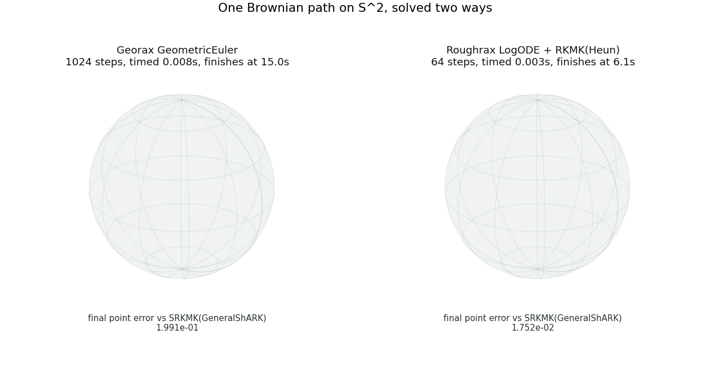

<p align="center">
  <picture>
    <source srcset="https://raw.githubusercontent.com/luke-a-thompson/roughrax/main/docs/_static/roughrax.dark.svg" media="(prefers-color-scheme: dark)">
    <source srcset="https://raw.githubusercontent.com/luke-a-thompson/roughrax/main/docs/_static/roughrax.light.svg" media="(prefers-color-scheme: light)">
    
  </picture>
</p>

<h2 align='center'>Rough Differential Equation Integration with Diffrax and Georax.</h2>

Roughrax enables the solving of rough differential equations natively in [Diffrax](https://github.com/patrick-kidger/diffrax) via the log-ODE method. Leveraging [PySigLib](https://github.com/daniil-shmelev/pySigLib) for signatures, Roughrax supports Stratonovich and Itô integration over Euclidean spaces, with support for homogeneous spaces provided by [Georax](https://github.com/luke-a-thompson/georax).

## LogODE

`LogODE` solves a rough differential equation by lifting log-signatures of the driving path into a frozen vector field and integrating that field with a wrapped Diffrax solver. You pick accuracy/adaptivity by choosing the base solver — `LogODE` reuses its Runge-Kutta coefficients.

- Wrap a fixed-step ERK (for example `Heun()`) for fixed-step rough integration.
- Wrap an adaptive ERK (for example `Dopri5()`) to keep automatic stepsizing,
  and clip its controller at every signature knot.
- Pass the base solver explicitly, for example `LogODE(diffrax.Tsit5())`.
- Wrap a geometric solver such as `georax.RKMK(diffrax.Tsit5())` when solving on a manifold.

Signature coefficients are local to one knot interval, so solver steps must not
cross knots. Use `diffrax.StepTo(signature_knots)` for fixed stepping, or preserve
adaptive stepping with:

```python
controller = diffrax.ClipStepSizeController(
    diffrax.PIDController(rtol=1e-5, atol=1e-7),
    step_ts=signature_knots,
)
```

## SignatureInterpolation and RoughTerm

`SignatureInterpolation` computes local log-signatures from a finely sampled
Diffrax `LinearInterpolation`-like control. The signature knots must be a regularly
strided subsequence of the control sample grid.

| Argument | Purpose |
|----------|---------|
| `control` | Fine driving path with `.ts` / `.ys` (e.g. `diffrax.LinearInterpolation`). |
| `signature_knots` | Coarse grid, equal to `control.ts[::stride]`, with one local log-signature per interval. |
| `depth` | Truncation depth of the log-signature. |
| `solution` | `"stratonovich"` (log-signature, Lyndon basis) or `"ito"` (branched signature, rooted-tree basis). |
| `correction` | Optional PySigLib correction passed unchanged to `branched_log_sig`; requires `solution="ito"`. |

`RoughTerm(vector_field, control, geometry)` then combines the materialised
signature control with level-one vector fields and the solution geometry. For a
vector field that already returns all lifted log-signature columns, use
`RoughTerm.from_lifted_vector_field(...)` explicitly.

## Understanding Rough Path Integration
1. Sample a (rough) driving path on a fine grid: $X_t \in \mathbb{R}^d$
1. Compute log-signatures of $X$ over each coarse interval $[t_k, t_{k+1}]$
1. At each coarse step, freeze the lifted vector field at $y_k$ and integrate one unit of time on the manifold — the log-signature contracts against the lifted fields to produce the update

## Usage

```python
import diffrax
import jax.numpy as jnp
from georax import Euclidean
from roughrax import LogODE, RoughTerm, SignatureInterpolation

# Vector field returns the stacked driving fields f_1, ..., f_d at y.
def vector_field(y):
    return jnp.stack([jnp.cos(y), jnp.sin(y)])

# A fine driving path — here a deterministic 2D control on [0, 1].
fine_ts = jnp.linspace(0.0, 1.0, 257)
fine_xs = jnp.stack([jnp.sin(3 * fine_ts), jnp.cos(2 * fine_ts)], axis=-1)
driver = diffrax.LinearInterpolation(ts=fine_ts, ys=fine_xs)

# Coarse grid the solver steps on; one log-signature is computed per interval.
coarse_ts = fine_ts[::32]

control = SignatureInterpolation(
    driver,
    coarse_ts,
    depth=3,
    solution="stratonovich",
)
term = RoughTerm(
    vector_field,
    control,
    Euclidean(),
)

# Then solve with a Log-ODE step driving the wrapped Diffrax solver.
sol = diffrax.diffeqsolve(
    term,
    LogODE(diffrax.Tsit5()),
    t0=float(coarse_ts[0]),
    t1=float(coarse_ts[-1]),
    dt0=None,
    y0=jnp.asarray(1.0),
    stepsize_controller=diffrax.StepTo(coarse_ts),
    saveat=diffrax.SaveAt(ts=coarse_ts),
)
```

### Linear matrix equations

`LinearMagnus` and `LinearFer` solve Stratonovich linear matrix equations
directly with matrix exponentials. `LinearMagnus` uses one exponential of the
full contracted log-signature. `LinearFer` uses homogeneous Fer factors and
supports log-signature depths through 6.

The vector field must expose its level-one matrices as a `matrix_basis` array of
shape `(driver_dim, matrix_dim, matrix_dim)`. The solver's `side` must match the
left or right matrix action implemented by the vector field.

The exact-rational Fer recipes are checked into
`roughrax/_solver/_fer_coefficients.py`. They were generated and exactly
verified with [Hofstaetter's BCH program](https://github.com/HaraldHofstaetter/BCH),
so that the logarithm of the factor product agrees with the Magnus generator
through every retained weighted degree. Regenerate the table after building
that program locally with:

```bash
uv run python tools/generate_fer_coefficients.py /path/to/BCH/bch --max-depth 6 \
  > roughrax/_solver/_fer_coefficients.py
```

### Branched Itô correction

`solution="ito"` selects branched log-signatures. Supply PySigLib's optional
`correction` directly; Roughrax does not infer a covariance or modify its
normalisation. For uniformly sampled Brownian motion with covariance `Sigma`,
PySigLib's level-2 correction is:

```python
dt = fine_ts[1] - fine_ts[0]
Sigma = jnp.eye(fine_xs.shape[-1])
correction = (dt * Sigma).reshape(-1)

control = SignatureInterpolation(
    driver,
    coarse_ts,
    depth=3,
    solution="ito",
    correction=correction,
)
```

PySigLib broadcasts a correction of shape `(C,)` over every path segment. It
also accepts per-window shapes `(stride, C)` and
`(len(coarse_ts) - 1, stride, C)`, where
`C = d**2 + ... + d**m` for correction levels 2 through `m`.

If the local Lyndon log-signatures have already been computed in PySigLib
method-1 ordering, construct the same control without retaining a raw path:

```python
# Shape: (len(coarse_ts) - 1, *batch_shape, logsig_dim).
control = SignatureInterpolation.from_logsignatures(
    coarse_ts,
    local_logsignatures,
    input_dim=2,
    depth=3,
)
```

`LinearMagnus` and `LinearFer` accept those batch dimensions directly. For a
generic `LogODE` solve, use `jax.vmap` over independent controls and initial states.

## Geometric usage

For manifold-valued equations, pass the target geometry to `RoughTerm` and wrap a geometric base solver with `LogODE`. The vector field should return the stacked driving fields in the coordinates expected by the manifold.

```python
import diffrax
import jax.numpy as jnp
from georax import CFEES25, SO
from roughrax import LogODE, RoughTerm, SignatureInterpolation


def so3_vector_field(y):
    del y
    return jnp.eye(3)


fine_ts = jnp.linspace(0.0, 1.0, 257)
fine_xs = jnp.stack(
    [
        0.2 * jnp.sin(3 * fine_ts),
        0.3 * jnp.cos(2 * fine_ts),
        0.1 * fine_ts,
    ],
    axis=-1,
)
driver = diffrax.LinearInterpolation(ts=fine_ts, ys=fine_xs)
coarse_ts = fine_ts[::32]

control = SignatureInterpolation(
    driver,
    coarse_ts,
    depth=3,
    solution="stratonovich",
)
term = RoughTerm(
    so3_vector_field,
    control,
    SO(3),
)

sol = diffrax.diffeqsolve(
    term,
    LogODE(CFEES25()),
    t0=float(coarse_ts[0]),
    t1=float(coarse_ts[-1]),
    dt0=None,
    y0=jnp.eye(3),
    stepsize_controller=diffrax.StepTo(coarse_ts),
    saveat=diffrax.SaveAt(ts=coarse_ts),
)
```

## Install

```bash
uv sync
```

## Convergence example

```bash
uv run python docs/examples/convergence.py
```

Solves a 2D rough ODE driven by Brownian motion at orders 1, 2, 3 against a fine Wong-Zakai reference and plots `h^(p/2)` convergence to `docs/examples/outputs/log_ode_convergence.png`.

## Sphere example


