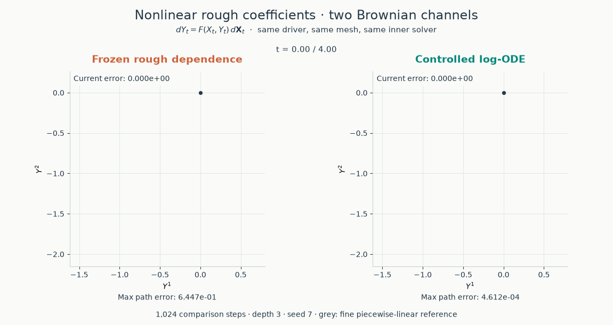

<p align="center">
  <picture>
    <source srcset="https://raw.githubusercontent.com/luke-a-thompson/roughrax/main/docs/_static/roughrax.dark.svg" media="(prefers-color-scheme: dark)">
    <source srcset="https://raw.githubusercontent.com/luke-a-thompson/roughrax/main/docs/_static/roughrax.light.svg" media="(prefers-color-scheme: light)">
    
  </picture>
</p>

<h2 align="center">Rough differential equations with Diffrax and Georax</h2>

Roughrax brings rough differential equations to
[Diffrax](https://github.com/patrick-kidger/diffrax). Solve in Euclidean space or
on manifolds, with geometric (Stratonovich) or branched (Itô) signatures.
It uses [PySigLib](https://github.com/daniil-shmelev/pySigLib) for signatures and
[Georax](https://github.com/luke-a-thompson/georax) for manifold geometry.

## Install

From a checkout of this repository:

```bash
uv sync
```

## Getting started

Start with a sampled path and a vector field. Wrap them in a `RoughTerm`, pick
an inner solver, and pass everything to Diffrax:

```python
import diffrax
import jax.numpy as jnp
from roughrax import LogODE, RoughTerm, SignatureInterpolation

# The leading axis indexes the driving fields.
def vector_field(y):
    return jnp.stack([jnp.cos(y), jnp.sin(y)])

fine_ts = jnp.linspace(0.0, 1.0, 257)
fine_xs = jnp.stack([jnp.sin(3 * fine_ts), jnp.cos(2 * fine_ts)], axis=-1)
driver = diffrax.LinearInterpolation(ts=fine_ts, ys=fine_xs)
coarse_ts = fine_ts[::32]

control = SignatureInterpolation(driver, coarse_ts, depth=3, solution="stratonovich")
term = RoughTerm(vector_field, control)
sol = diffrax.diffeqsolve(
    term,
    LogODE(diffrax.Tsit5()),
    t0=coarse_ts[0],
    t1=coarse_ts[-1],
    dt0=None,
    y0=jnp.asarray(1.0),
    stepsize_controller=diffrax.StepTo(coarse_ts),
    saveat=diffrax.SaveAt(ts=coarse_ts),
)
```

Here, each log-signature covers 32 sample intervals. `StepTo` keeps the solver
on that grid. Choose the signature grid with `fine_ts[::stride]`; steps cannot
cross signature knots.

To solve a batch of paths, wrap the solve in `jax.vmap`.

### Controlled coefficients

The vector field can depend on the driver too. Write it as `F(x, y, args)` and
let JAX compute its controlled derivatives:

```python
from roughrax import ControlledVectorField

def F(x, y, args):
    return jnp.stack([jnp.sin(x[0] + y), jnp.cos(x[1] - y)])

coefficient = ControlledVectorField.from_driver(F, driver, depth=control.depth)
term = RoughTerm(coefficient, control)
```

Use the same driver for the coefficient and its signatures. Its values should
have shape `(driver_dim,)`.

You can also supply the derivatives yourself:
`ControlledVectorField(vf, vf_prime, vf_prime_prime)` for depth three. Each
callback takes `(t, y, args)`; `None` means a derivative is zero. These describe
variation along the rough driver with `y` held fixed. See
[ControlledVectorField](roughrax/_controlled.py) for the tensor layout and
regularity requirements.

Controlled coefficients currently support geometric signatures. The
[scalar example](docs/examples/controlled_brownian.py) is a small place to start;
the [nonlinear example](docs/examples/controlled_nonlinear.py) uses two Brownian
channels and plots the resulting paths.

### Manifolds

To solve on a manifold, pass its geometry as the third argument to `RoughTerm`
and choose a geometric inner solver, such as `LogODE(georax.RKMK(diffrax.Heun()))`.
Your vector field should return frame coordinates for that geometry.
The [sphere example](docs/examples/worm_sphere_sde.py) shows this with SO(3).

### Linear matrix equations

For linear matrix equations, use `LinearMagnus` or `LinearFer`. Magnus takes
one matrix exponential per step. Fer uses a product of exponentials and supports
depths up to 6.

Both take geometric signatures. Give the vector field a `matrix_basis` array
of shape `(driver_dim, matrix_dim, matrix_dim)` and set `side` to match its
left or right matrix action. The Fer coefficients are generated by
[this script](tools/generate_fer_coefficients.py).

### Itô correction

Set `solution="ito"` for branched signatures. For Brownian samples with constant
time spacing and covariance `Sigma`, supply the correction like this:

```python
dt = fine_ts[1] - fine_ts[0]
Sigma = jnp.eye(fine_xs.shape[-1])
control = SignatureInterpolation(
    driver, coarse_ts, depth=3, solution="ito",
    correction=(dt * Sigma).reshape(-1),
)
```

Roughrax passes `correction` straight to PySigLib. Supply the covariance of your
driver; the identity above is for independent standard Brownian channels.

### Precomputed signatures

Use `SignatureInterpolation.from_logsignatures(ts, coeffs, input_dim, depth)`
to load log-signatures in PySigLib's method-1 Lyndon ordering.
If you have already lifted your fields to log-signature columns, use
`RoughTerm.from_lifted_vector_field(...)`.

## Examples

Run an example from the repository root:

```bash
uv run python docs/examples/controlled_nonlinear.py
```

- [controlled_brownian.py](docs/examples/controlled_brownian.py): integrate
  `dY = X dX` and compare with the exact solution.
- [controlled_nonlinear.py](docs/examples/controlled_nonlinear.py): watch a
  nonlinear controlled RDE unfold alongside a fine piecewise-linear reference.
- [worm_sphere_sde.py](docs/examples/worm_sphere_sde.py): follow a path on a sphere.
- [convergence.py](docs/examples/convergence.py): compare accuracy as the mesh
  gets finer.

Outputs are saved in `docs/examples/outputs/`.




## Citation
If you use roughrax, please cite:

```bibtex
@article{thompson2026learningmanifolditodynamics,
      title={Learning Manifold and It\^o Dynamics with Branched Neural Rough Differential Equations}, 
      author={Luke Thompson and Dai Shi and Lequan Lin and Junbin Gao and Andi Han},
      year={2026},
      eprint={2606.05272},
      archivePrefix={arXiv},
      primaryClass={cs.LG},
      url={https://arxiv.org/abs/2606.05272}, 
}
```

and, if you use the log-ODE method,

```bibtex
@article{AIHPB_1996__32_2_231_0,
  author = {Castell, Fabienne and Gaines, Jessica},
  title = {The ordinary differential equation approach to asymptotically efficient schemes for solution of stochastic differential equations},
  journal = {Annales de l'I.H.P. Probabilit\'es et statistiques},
  pages = {231--250},
  year = {1996},
  publisher = {Gauthier-Villars},
  volume = {32},
  number = {2},
  mrnumber = {1386220},
  zbl = {0851.60054},
  url = {https://www.numdam.org/item/AIHPB_1996__32_2_231_0/}
}
```
